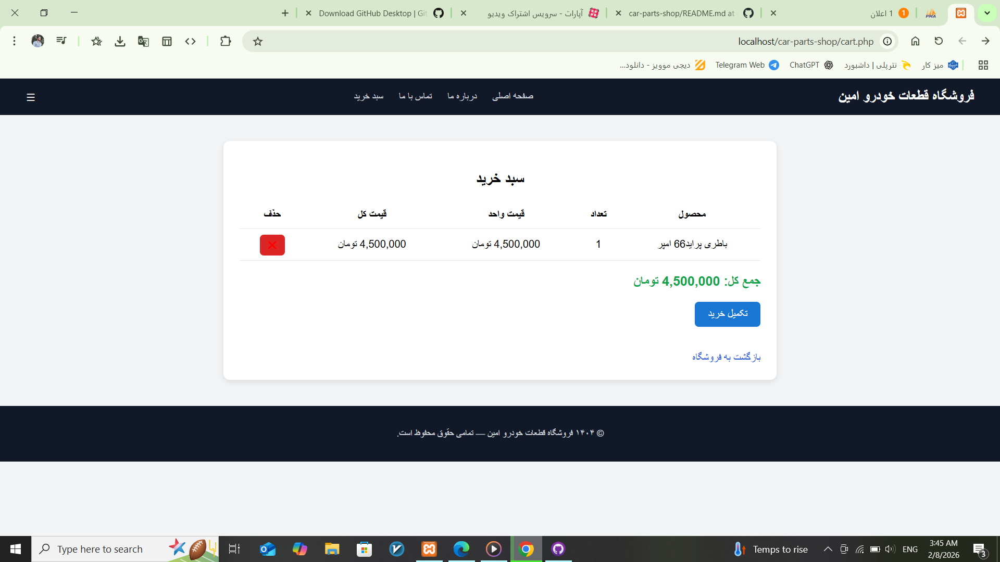
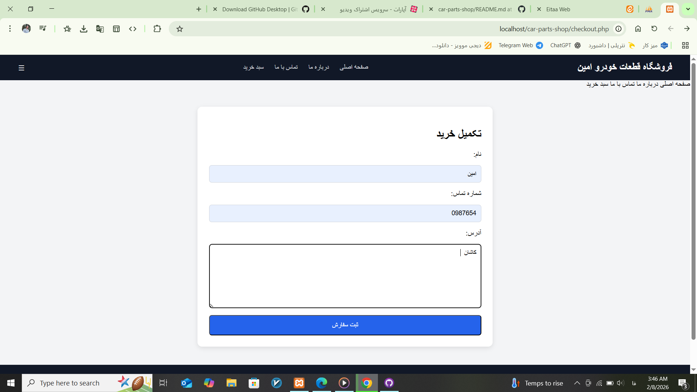
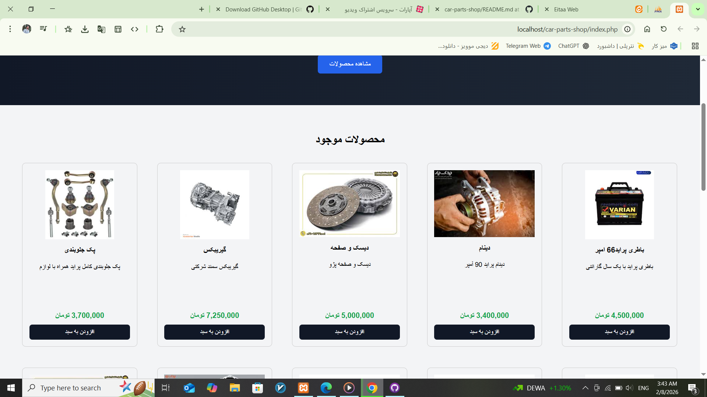

# car-parts-shop

مستندات پروژه فروشگاه آنلاین قطعات خودرو

عنوان پروژه: طراحی و پیاده‌سازی فروشگاه اینترنتی 
قطعات خودرو با استفاده از PHP و MySQL

استاد مربوطه:آقای میثم تکیه بند

دانشجو:امین عصارزاده

موضوع پروژه: طراحی و پیاده سازی فروشگاه اینترنتی قطعات خودرو

کد دانشجویی:0222102470036

زمستان1404
 
فهرست مطالب

فروشگاه اینترنتی قطعات خودرو 🚗

این پروژه یک فروشگاه اینترنتی ساده برای فروش قطعات خودرو است که با استفاده از PHP و MySQL طراحی شده است.

## ویژگی‌ها

- نمایش لیست محصولات
- جستجوی محصول
- سبد خرید با استفاده از Session
- ثبت سفارش و ذخیره در پایگاه داده
- فرم تماس با ما
- پنل مدیریت برای مشاهده سفارش‌ها و پیام‌ها

## نحوه اجرا

1. پروژه را در پوشه htdocs یا مسیر سرور محلی خود قرار دهید.
2. فایل پایگاه داده car_parts_shop.sql را در phpMyAdmin ایمپورت کنید.
3. اطلاعات اتصال به دیتابیس را در فایل db.php تنظیم کنید.
4. مرورگر را باز کرده و به آدرس http://localhost/car-parts-shop/index.php بروید.

## پیش‌نمایش

## اطلاعات بیشتر

برای اطلاعات بیشتر یا همکاری، لطفاً با من تماس بگیرید.

